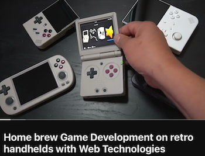
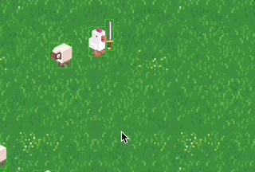

# Code Snippets

## Essentials

- [Actors, flip en rotate](#actors)
- [Collisions](#collision)
- [Click en Exit Screen Events](#click-en-exit-screen-events)
- [Keyboard besturing](#keyboard-besturing)
- [Gamepad besturing](./gamepad.md)
- [Camera volgt speler](#camera-volgt-speler)
- [Geluid en Fonts laden](#sound-and-fonts)
- [Spritesheet](./spritesheet.md)
- [Scenes](#scenes)
- [Physics en hitbox](./physics.md)
- [Scherm instellingen (afmeting, pixel art, loading, fullscreen)](./scherm.md)
- [Spawning](#spawning)
- [Timer](#timer)
- [Tekst met score](./tekstveld.md)
- [UI met healthbar](./ui.md)
- [Troubleshooting](./snippets/troubleshooting.md)

## Advanced

- [Tiling en Scrolling Background](./scrolling.md)
- [Een auto besturen](./movedirection.md)
- [Actors zoeken in een Scene](#actors-zoeken)
- [Een karakter met verschillende wapens](#wapens)
- [Particles](./particles.md)
- [Shaders](./shaders.md)
- [Random tint](#random-tint)
- [JSON laden](#json-laden)
- [Afstanden en vectoren](./vector.md)
- [Enemy behaviour](./behaviour.md)
- [Voortgang opslaan met localStorage](https://developer.mozilla.org/en-US/docs/Web/API/Window/localStorage)
- [Online Multiplayer met Socket.IO](https://socket.io) of [Lance](https://lance-gg.github.io)
- [Type Checking](./typechecking.md)
- [Een excalibur project opzetten zonder het startproject](./snippets/advanced.md)

## Assets

- [CraftPix 2D assets](https://craftpix.net)
- [itch.io assets](https://itch.io/game-assets), [Open Game Art](https://opengameart.org), [Kenney Assets](https://www.kenney.nl/assets)
- [Create Game Sounds](https://sfxr.me) en [AI Sound Effects](https://elevenlabs.io/sound-effects)
- [Sprite Sheet Maker](https://www.finalparsec.com/tools/sprite_sheet_maker)
- [AI Pixel Art generator](https://aipixelartgenerator.com/) 
- [Pixel fonts](https://www.dafont.com/bitmap.php)

## Links

- [Plaats je game op itch.io](https://itch.io/docs/creators/html5)
- [Standalone Game met Electron](https://github.com/excaliburjs/template-electron)
- [Important changes in V0.30](https://github.com/excaliburjs/Excalibur/releases/tag/v0.30.0) and [V0.29 notes](https://github.com/excaliburjs/Excalibur/releases/tag/v0.29.0)
- [Excalibur Gallery](https://excaliburjs.com/gallery/), [Show and Tell](https://github.com/excaliburjs/Excalibur/discussions/categories/show-and-tell)
- [Tenpa Examples](https://github.com/tenpaMk2/excalibur-examples), [Terrible Games](https://github.com/dcgw)
- [Javascript Game Development](https://gamedevjs.com) en [Newsletter](https://gamedevjsweekly.com)
- [Javascript Game Design Patterns](https://designpatternsgame.com/patterns)
- [Game Programming Patterns](https://gameprogrammingpatterns.com)
- [MDN Game Development](https://developer.mozilla.org/en-US/docs/Games)
- [MDN Object Oriented Programming](https://developer.mozilla.org/en-US/docs/Learn/JavaScript/Objects/Object-oriented_programming)
- [Javascript games spelen op een handheld emulator](https://www.youtube.com/watch?v=osJsBRPSrM4)




<br><br><br>


## Actors, flip en rotate

Een actor met een sprite ziet er als volgt uit. In de `constructor` geef je de ***hitbox*** van de actor door. In `onInitialize()` zet je de meeste basic settings.

```js
export class Goomba extends Actor {
    constructor() {
        super({ width: Resources.Goomba.width, height: Resources.Goomba.height })
    }
    onInitalize(engine){
        this.graphics.use(Resources.Goomba.toSprite())
        this.pos = new Vector(200,200)   // positie
        this.vel = new Vector(20,0)      // snelheid
    }
}
```

#### Rotate sprite


```js
export class Peach extends Actor {
    onInitalize(engine){
        this.rotation = 0.5
        this.angularVelocity = 0.2
    }
}
```
Standaard wordt een afbeelding gecentreerd op een Actor. Als je niet om het middelpunt wil roteren dan kan je een `anchor` gebruiken. *Dit moet je via de constructor doorgeven.*
```js
export class Toad extends Actor {
    constructor() {
        super({
            anchor: new Vector(0, 0),
            width: Resources.Toad.width, 
            height: Resources.Toad.height 
        })
    }
}
```
#### Bewegen in de richting van de rotation

```js
let fish = new Actor()
fish.rotation = 0.3
let directionVector = Vector.fromAngle(fish.rotation);
fish.vel = directionVector
```

#### Flip sprite

```javascript
export class Bowser extends Actor {
    onInitialize(engine) {
        this.graphics.use(Resources.Bowser.toSprite())
        this.graphics.flipHorizontal = true
    }
    onPreUpdate(engine){
        this.graphics.flipHorizontal = (this.vel.x > 0)
    }
}
```


<br><br><br>


## Collision

Met de collision events kan je checken of je Actor ergens tegenaan botst. Let op dat je actor een `width`,`height`, OF een `radius` heeft. Het CollisionType bepaalt hoe objecten reageren op botsingen.

- `CollisionType.Active` (objecten duwen elkaar weg)
- `CollisionType.Passive` (objecten bewegen door elkaar heen)
- `CollisionType.Fixed` (kan niet bewegen, objecten kunnen niet door fixed objecten heen)
- `CollisionType.PreventCollision` (geen collisions)

<br>

```javascript
export class Ship extends Actor {

    constructor() {
        super({ width: 100, height: 100, collisionType:CollisionType.Active }) 
        // hit circle
        // super({radius: 50, collisionType:CollisionType.Active})
    }
    
    onInitialize(engine) {
        this.on('collisionstart', (event) => this.hitSomething(event))
    }

    hitSomething(event){
        if (event.other.owner instanceof Enemy) {
            // Je kan `instanceof` gebruiken om te zien waar je tegenaan botst.
            console.log('hit enemy')
        }
    }
}
```

#### Hitbox

De hitbox hoeft niet hetzelfde te zijn als de `width,height` van de sprite. In dit voorbeeld maken we een custom hitbox.

```js
export class Player extends Actor {
    onInitialise(engine) {
        const box = Shape.Box(100, 100) // optioneel: anchor, offset
        this.collider.set(box)
    }
}
```

- Met [Physics](./physics.md) maak je botsingen meer realistisch (zwaartekracht, gewicht)
- Een [Collision Group](./collisiongroup.md/) zorgt dat actors in dezelfde group nooit met elkaar colliden. 

<br><bR><br>

## Click en Exit Screen Events

On Exit Screen Event
```javascript
class Fish extends Actor {
    onInitialize(engine) { 
        // capture mouse clicks
        this.enableCapturePointer = true
        this.pointer.useGraphicsBounds = true
        this.on("pointerup", (event) => this.resetPosition())
        // event als actor buiten beeld gaat
        this.on("exitviewport", (event) => this.resetPosition())
    }
    resetPosition(){
        this.pos = new Vector(1000,10)      // verplaatsen
        this.kill()                         // verwijderen
    }
}
```
Je kan ook handmatig checken of een Actor off screen is
```js
class Fish extends Actor {
    onPostUpdate(engine){
        if (this.isOffScreen) {
            this.kill()
        }
    }
}
```
<br><br><br>

## Keyboard besturing

In dit voorbeeld kijken we in elke `update` frame welke toetsen zijn ingedrukt. Doordat je in de `update` naar de toetsenbord status kijkt, weet je zeker dat alleen de huidige `scene` naar het toetsenbord luistert *(inactieve scenes worden niet geupdate).*

- Via `isHeld` kan je continu op een keypress reageren (movement). 
- Via `wasPressed` kan je eenmalig op een keypress reageren (shooting / jumping).

```javascript
class Shark extends Actor {

    onPreUpdate(engine) {
        let xspeed = 0
        let yspeed = 0
        let kb = engine.input.keyboard

        if (kb.isHeld(Keys.W) || kb.isHeld(Keys.Up)) {
            yspeed = -300
        }
        if (kb.isHeld(Keys.S) || kb.isHeld(Keys.Down)) {
            yspeed = 300
        }
        if (kb.isHeld(Keys.A) || kb.isHeld(Keys.Left)) {
            xspeed = -300
            this.graphics.flipHorizontal = true       // flip de sprite
        }
        if (kb.isHeld(Keys.D) || kb.isHeld(Keys.Right)) {
            xspeed = 300
            this.graphics.flipHorizontal = false      // flip de sprite
        }
        this.vel = new Vector(xspeed, yspeed)
        
        // als er maar 1x iets gebeurt check je of die key was ingedrukt in dit frame
        if (kb.wasPressed(Keys.Space)) {
            this.shoot()
        }
    }
    
    shoot() {
        console.log("💥 Shoot!")
    }
}
```
#### Binnen beeld blijven

Pas de speed alleen aan als de actor nog voldoende van de rand van het level is verwijderd. Omdat het draaipunt in het midden van het object zit,
moeten we aan de randen van de viewport rekening houden met de helft van de hoogte en de breedte. 

```js
onPreUpdate(engine) {
    let xspeed = 0;
    let yspeed = 0;

    let kb = engine.input.keyboard;
    
    if (kb.isHeld(Keys.Up) && this.pos.y > this.height / 2) {
        yspeed = -300;
    }
    if (kb.isHeld(Keys.Down) && this.pos.y < engine.drawHeight - this.height / 2) {
        yspeed = 300;
    }
    if (kb.isHeld(Keys.Left) && this.pos.x > this.width / 2) {
        xspeed = -300;
    }
    if (kb.isHeld(Keys.Right) && this.pos.x < engine.drawWidth - this.width / 2) {
        xspeed = 300;
    }
    this.vel = new Vector(xspeed, yspeed);
}
```

Voor actors zonder keyboard input kan je ook `clamp` gebruiken. 

```js
import { clamp } from "excalibur"

class Shark extends Actor {
    onPreUpdate(engine) {
        this.pos.x = clamp(this.pos.x, 0, 1280);   // afmeting van het level
        this.pos.y = clamp(this.pos.y, 0, 720);    // afmeting van het level
    }
}
```
> *Als je [physics](./physics.md) gebruikt kan je `edge colliders` aan de rand van je level plaatsen.*

<br><br><br>

### Keyboard events

Het is mogelijk om te subscriben aan keyboard events. **Event listeners blijven echter altijd actief, ook als je wisselt tussen scenes.** Je kan een listener uit zetten met `off()`.

```js
class Game extends Engine {
    startGame() {
        this.input.keyboard.on("press", (evt) => this.keyPressed(evt))
    }
    keyPressed(evt){
        if (evt.key === Keys.Space) {
            console.log("space was pressed")
        }
    }
    gameOver(){
        this.input.keyboard.off("press")
    }
}
```

<br><br><br>

## Camera volgt speler

Om een top-down RPG of een sidescroller te maken doe je de volgende stappen:

- Maak een `player` met besturing.
- Maak een level dat groter is dan de game *(In dit voorbeeld is de game `800x450` en het level is `2000x1200`)*.
- Laat de camera de speler volgen. 

GAME.JS
```js
export class Game extends Engine {
    constructor(){
        super({width:800, height:450})
    }
    startGame(){
        this.currentScene.camera.strategy.lockToActor(this.player)
        this.currentScene.camera.strategy.limitCameraBounds(new BoundingBox(0, 0, 2000, 1200))
    }
}

```
Om je [UI](./ui.md) in beeld te laten staan terwijl de camera beweegt, heb je een [ScreenElement](https://excaliburjs.com/api/class/ScreenElement/) nodig.

- [Camera](https://excaliburjs.com/docs/cameras/)
- [Screenelement](https://excaliburjs.com/api/class/ScreenElement/)

<br><br><br>

## Sound and fonts

Geluid en fonts laden

Plaats images, fonts en sounds in de public folder.

RESOURCES.JS
```js
import { ImageSource, Sound, Resource, Loader, FontSource } from 'excalibur'
const Resources = {
    Ship: new ImageSource('images/ship.png'),
    LevelStart: new Sound("sounds/LevelStart0.wav"),
    PixelFont: new FontSource('fonts/PressStart2P-Regular.ttf', 'PressStart')
}

const ResourceLoader = new Loader()
for (let res of Object.values(Resources)) {
    ResourceLoader.addResource(res)
}
```
Fonts en sounds gebruiken
```js
import {Label, FontUnit, Color, Vector} from "excalibur"
import {Resources} from "./resources.js"

class Game extends Engine {
    startGame() {
        // speel een geluidje
        Resources.LevelStart.play()
        // gebruik een pixel font
        const label = new Label({
            text: 'Score: 0',
            pos: new Vector(0, 0),
            font: Resources.PixelFont.toFont({
                unit: FontUnit.Px,
                size: 20,
                color: Color.White
            })
        })
        this.add(label)
    }
}
```

<br><br><br>

## Scenes

Je plaatst je `Actors` in `Scenes`, waardoor de `Game` kan wisselen tussen scenes. 
Een scene heeft een `onActivate` functie, deze wordt elke keer aangeroepen dat de scene actief wordt.

Een `Actor` weet altijd in welke scene de actor zit, via `this.scene`. Je kan via `this.scene.engine` de game aanroepen om van scene te kunnen wisselen. 

Let op dat als je *uit* een scene gaat, dat alle actors en variabelen "bevriezen". Zodra je terug naar de scene gaat, ga je verder waar je gebleven was.

```javascript
import { Level1 } from './scenes/level1'
import { GameOver } from './scenes/gameover'

class Game extends Engine {
    startGame() {
        this.add('level', new Level())
        this.add('gameover', new GameOver())
        this.goToScene('level')
    }
}
```
LEVEL

```javascript
export class Level extends Scene {

    score

    onInitialize(engine) {
        console.log("this level is created only once.")
        this.score = 0
        let player = new Player()
        this.add(player)
    }

    onActivate(ctx) {
        console.log("the game has switched to this level. player already exists. reset score to 0")
        this.score = 0
    }

    gameOver() {
        this.engine.goToScene('gameover')
    }
}
```

#### Scene transitions

```js
class Game extends Engine {
    startGame() {
        let transitions = {
            in: new FadeInOut({ duration: 400, direction: 'in', color: Color.Black }),
            out: new FadeInOut({ duration: 400, direction: 'out', color: Color.Black })
        }
        this.add('intro', { scene: new Intro(), transitions })
        this.add('level', { scene: new Level(), transitions })
        this.goToScene('level')
    }
}
```
<br>

#### Waarden doorgeven aan een scene

```javascript
this.scene.engine.goToScene("game-over", { sceneActivationData: { score: 40 }})
```
Dit kan je als volgt uitlezen:
```javascript
export class GameOver extends Scene {
    onActivate(ctx) {
        console.log(`SCORE: ${ctx.data.score}`)
    }
}
```

<br><br><br>

## Spawning

Met spawning bedoelen we dat er tijdens de game nieuwe actors worden aangemaakt. 

Als een Actor schiet, dan spawned er een bullet in de game. De positie van die bullet is meestal de positie van de actor.

```js
export class Player extends Actor {
    shoot() {
        let b = new Bullet()
        b.pos = new Vector(this.pos.x, this.pos.y)
        this.scene.add(b)
    }
}
export class Bullet extends Actor {
    constructor() {
        super({ width: 10, height: 10 }) 
    }
}
```
> *Als de Player een child van een andere actor is, dan kan je ook via `this.globalPos.x, this.globalPos.y` de exacte positie in de wereld opvragen.*

Vergeet niet om gespawnde bullets ook weer uit de game te verwijderen

```js
export class Bullet extends Actor {
    onInitialize(engine) {
        this.events.on("exitviewport", () => this.kill());
    }
}
```
### Explosions

Als een bullet een vijand raakt kan je een explosie spawnen op die positie. De explosie verwijdert zichzelf na een fade-out.

```js
export class Explosion extends Actor {

     constructor(x, y) {
        super({x,y,width:100, height:100})
     }
     onPostUpdate(engine) {
        this.scale = this.scale.add(new Vector(0.06, 0.06))
        this.graphics.opacity -= 0.05
        if(this.graphics.opacity < 0.01) {
            this.kill()
        }
    }
}
```

<br><br><br>

## Timer

Je kan in Excalibur geen `setInterval` of `setTimeout` gebruiken omdat daarbij geen rekening met de gameloop wordt gehouden.

De simpelste oplossing hiervoor is om zelf een frame counter bij te houden. Elke keer dat er een aantal frames is verstreken laat je iets gebeuren.

```js
export class Fish extends Actor {

    frameCounter

    constructor() {
        super({width:100,height:100})
        this.frameCounter = 0
    }

    onPostUpdate(engine) {
        this.frameCounter++
        if(this.frameCounter > 120) {
            console.log("2 seconden verstreken")
            this.frameCounter = 0
        }
    }
}
```

Je kan in excalibur een `delay` toevoegen voordat code wordt uitgevoerd:

```js
class Fish extends Actor {

    onInitialize(engine) {
        engine.clock.schedule(() => {
                console.log("this message shows after 2 seconds")
        }, 2000)
    }
}

```
Excalibur heeft ook een `Timer` class:

```js
export class Game extends Engine {
    startGame() {
        this.timer = new Timer({
            fcn: () => this.spawn(),
            interval: 800,
            repeats: true
        })
        this.add(this.timer)
        this.timer.start()
    }

    spawn() {
        this.add(new Ball())
    }
}
```

    
<br><br><br>


# Advanced
 
## Actors zoeken

De game heeft een array van actors: `this.currentScene.actors` *(Vanuit een actor is dit: `this.scene.actors`)*

Je kan met `filter` naar alle actors van een bepaald type zoeken. Je kan `find` gebruiken om een enkele actor van een type te zoeken. 

Je kan ook zelf door de actors heen loopen.

```js
class Game extends Engine {

    startGame(){
        let someShark = new Shark()
        this.add(someShark)
        for(let i = 0; i < 10; i++) {
            let f = new Fish()
            this.add(f)
        }
    }

    howManyFishes() {
        let fishes = this.currentScene.actors.filter(act => act instanceof Fish)
        console.log(`Er zijn nog ${fishes.length} vissen`)
    }

    findShark() {
        let shark = this.currentScene.actors.find(act => act instanceof Shark)
        console.log(shark)
    }

    gameOver() {
        for(let actor of this.currentScene.actors) {
           actor.kill()
        }
        this.startGame()
    }
}
```


<Br><br><br>

## Wapens



Met composition kan je een karakter verschillende wapens geven. Door te zorgen dat elk wapen dezelfde functies gebruikt, kan elk wapen een ander effect krijgen.

```js
class ArmedChicken extends Actor {
    onInitialize(engine){
        this.weapon = new Gun()
        this.addChild(this.weapon)
    }
    attack(){
        this.weapon.hit() // dit werkt voor machinegun en gun
    }
}
```
```js
class Gun extends Actor {
    hit(){
        let bullet = new Bullet()
        this.scene.engine.add(bullet)
    }
}
```
```js
class MachineGun extends Actor {
    hit(){
        for(let i = 0; i< 10;i++) {
            let bullet = new Bullet()
            this.scene.engine.add(bullet)
        }
    }
}
```
- [Voorbeeldcode kip met zwaard 🗡️🐔](https://stackblitz.com/edit/excalibur-chicken) 

<br><br><br>

## Random tint

```js
let sprite = Resources.Mario.toSprite()
sprite.tint = new Color(Math.random() * 255, Math.random() * 255, Math.random() * 255)
```

<br><br><Br>

## JSON laden

Als je `import` gebruikt wordt het JSON bestand onderdeel van je project tijdens de `build` stap. Je hoeft het niet toe te voegen aan de excalibur loader. Als de data van een externe server komt (of als het bestand heel groot is) is het beter om `fetch` te gebruiken.

VOORBEELD

```javascript
import jsonData from "../data/pokemon.json"

class Pokemon extends Actor {
    showPokemon(){
        for(let p of jsonData) {
            console.log(p)
        }
    }
}
```
<br><br><br>


