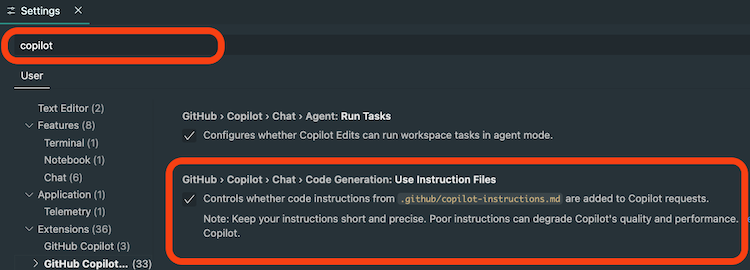

# Hulp vragen aan AI

- [Prompting in de browser](#prompting)
- [Voorbeelden](#prompt-voorbeelden)
- [Resultaat evalueren](#resultaat-evalueren)
- [Prompting in de editor](#copilot-in-vs-code)
- [Prompt Instructions](#prompting)
- [Chat met Github Repositories](#chat-met-de-repository)
- [CMGT chatbot](#cmgt-chatbot)
- [Codebase](#codebase)

<br>

> ⚠️ *Disclaimer: AI modellen zijn nog niet heel goed in het werken met Excalibur. Hou je prompts daarom klein, geef altijd instructies mee, en vergelijk altijd het resultaat met de lesstof*

<br><br><br>

## Prompting in de browser

Bij het doen van een prompt in ChatGPT, Claude, Blackbox, etc. over Excalibur moet je goede instructies meegeven, omdat het antwoord anders niet voldoende overeenkomt met de werkwijze uit de lessen.

Voordat je gaat prompten, kan je deze minimale instructies sturen:

```
I am using the excaliburjs library at https://github.com/excaliburjs/Excalibur and object oriented programming, to create a game.
Please use the following code examples to format classes in the game. I use vite to test and build the game. I do not use the global "ex." namespace for excalibur.

import {Engine,Actor,Vector} from "excalibur";
import {Player} from "./player.js";
import {Enemy} from "./enemy.js";

export class Game extends Engine {
    enemy
    player
    startGame() {
        this.player = new Player()
        this.add(this.player)

        this.enemy = new Enemy()
        this.add(this.enemy)
    }
}

export class Enemy extends Actor {
    constructor(){
        super({width:100, height:100})
        this.pos = new Vector(100,100)
        this.vel = new Vector(5,0)
    }
}
```

<br><br><br>

## Prompt voorbeelden

- Start with the setup of a game with a player and a enemy
- What is the benefit of using OOP programming for games
- How can I make the player class respond to keyboard input
- I have two enemy types, can you apply inheritance here
- Why doesn't the player fall when I walk off the platform
- My game class keeps the score. How can I adjust this from my player
- I want to make the player shoot a bullet, what is a good way to handle this ?

#### 🚨 Vibe coding

Als je prompts te algemeen zijn ga je heel onvoorspelbare resultaten krijgen. Daarnaast helpt het je niet om de basis principes van game programming zelf te leren.

- Maak een game
- Maak flappy bird
- Hij doet het niet

<br><br><br>

## Resultaat evalueren

Vraag om uitleg van gegenereerde code, zodat je zelf beter begrijpt. Check of gegenereerde code overeenkomt met de instructies. 

🚨 *Hieronder zie je een voorbeeld van Excalibur code die niet overeenkomt met de lessen, omdat er geen instructies zijn meegegeven*

```js
const engine = new ex.Engine({
  width: 600,
  height: 400,
});

const actor1 = new ex.Actor({ width: 50, height: 50 });
engine.add(actor1);
```

<br><br><br>

## Copilot in VS Code

- Zet Copilot aan (gratis in VS Code)
- Vraag eventueel het [student developer pack](https://education.github.com/pack) aan voor meer voordelen.
- Leer het verschil tussen ASK / EDIT / AGENT mode, en de verschillende modellen
- Gebruik CMD/CTRL + i om inline te prompten
- Zet TAB mode uit
- Maak een selectie in je code om daar specifiek vragen over te stelle±
- Gebruik "/" om meteen iets uit te leggen of te fixen


<br><br><br>

## Prompt Instructions in VS Code

Je kan in je code editor automatisch prompt instructies meegeven:

- Zet de "instructions" optie aan: *settings > copilot > use instruction files*
- Plaats [copilot-instructions.md](./copilot-instructions.md) in `.github/copilot-instructions.md`.
- Zet [⚙️ github.copilot.chat.codeGeneration.useInstructionFiles](vscode://settings/github.copilot.chat.codeGeneration.useInstructionFiles) op `true`.
- [Meer info op de VS Code site](https://code.visualstudio.com/docs/copilot/copilot-customization#_use-instruction-files)



<br><br><br>

## Chat met Github Repositories

Je kan in [de PRG4 repository](https://github.com/HR-CMGT/PRG04-2024-2025/) en in de officiele [Excalibur Repository](https://github.com/excaliburjs/Excalibur) op het ***copilot*** icoontje klikken om een chatvenster te openen. Je kan dan specifieke vragen over de repository stellen. 

> ⚠️ *Let op dat je hier nog steeds instructies moet meegeven, minimaal dat je met Object Oriented Programming classes werkt, zonder de "ex." namespace.*


<br><br><br>

## CMGT Chatbot

De [CMGT chatbot](https://ai-assistent-mu.vercel.app) heeft de instructies over de lesstof al ingebouwd.


https://ai-assistent-mu.vercel.app

<br><br><br>

## Codebase

⚠️ Optioneel

- Plaats de PRG4 code snippets en de readme files van les 1 t/m 8 in je projectmap.
- Gebruik de hashtag `#codebase` in je prompts in VS Code, dit zorgt dat copilot gaat zoeken in die .md files naar een antwoord. Prompts duren dan wel langer en kosten meer tokens!

<br><br><br>
