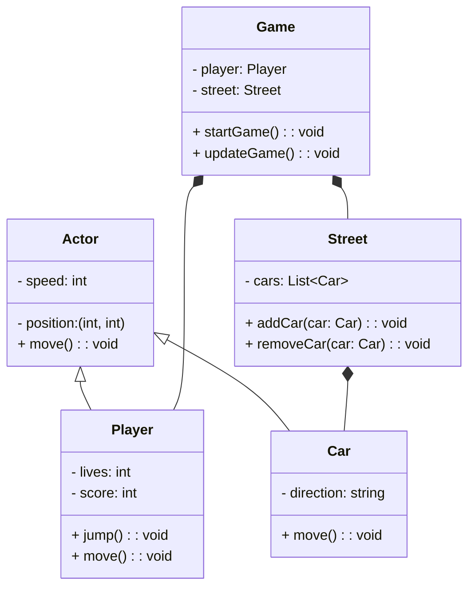

# Class diagram

```mermaid
classDiagram
    class Actor {
      - position: (int, int)
      - speed: int
      + move(): void
    }
    
    class Player {
      - lives: int
      - score: int
      + jump(): void
      + move(): void
    }
    
    class Car {
      - direction: string
      + move(): void
    }
    
    class Street {
      - cars: List~Car~
      + addCar(car: Car): void
      + removeCar(car: Car): void
    }
    
    class Game {
      - player: Player
      - street: Street
      + startGame(): void
      + updateGame(): void
    }
    
    Actor <|-- Player
    Actor <|-- Car
    Game *-- Player
    Game *-- Street
    Street *-- Car
```