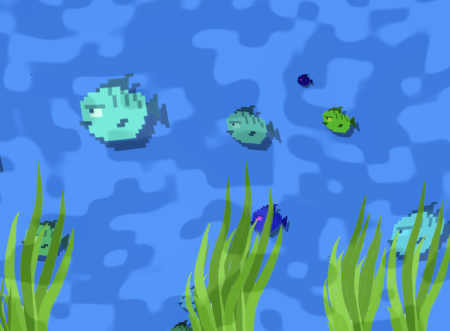

# Shaders

Een shader is een visueel effect dat je toepast met WebGL. Het effect kan op je hele game of op een enkele actor worden toegepast.

Shader code is geschreven in de GLSL taal. Shader code moet je als string in je javascript class plakken, met backticks. Let op enters en spaties. Je kan online voorbeelden van shaders vinden, bv.

- [Shadertoy water](https://www.shadertoy.com/view/MdlXz8)
- [Balatro background](https://www.shadertoy.com/view/XXjGDt)
- [Godot shaders](https://godotshaders.com)
- [GLSL Sandbox](http://glslsandbox.com/)
- [The book of shaders](https://thebookofshaders.com/)
- [Vraag ChatGPT om een shader te schrijven](https://www.chatgpt.com)

<br>

<br>
[🌱 Shader demo: water en wavy plants](https://hr-cmgt.github.io/PRG04-2024-2025-finished/aquarium/docs/)

<br><br><br>

## Shader op de hele game

```js
import { ScreenShader } from "excalibur"

export class GrayScalePostProcessor {
    _shader

    initialize(gl) {
        this._shader = new ScreenShader(gl, `#version 300 es
      precision mediump float;
      uniform sampler2D u_image;
      in vec2 v_uv;
      out vec4 fragColor;
      void main() {
        vec4 tex = texture(u_image, v_uv); 
        float avg = 0.2126 * tex.r + 0.7152 * tex.g + 0.0722 * tex.b;
        fragColor = vec4(avg, avg, avg, 1.0);
      }
    `);
    }

    getLayout() {
        return this._shader.getLayout();
    }

    getShader() {
        return this._shader.getShader();
    }
}
```
game.js
```js
import { GrayScalePostProcessor } from "./shaders/grayscale"

export class Game extends Engine {
    constructor() {
        super({ width: 800, height: 600, displayMode: DisplayMode.FitScreen})
        const grayScaleProcessor = new GrayScalePostProcessor()
        this.graphicsContext.addPostProcessor(grayScaleProcessor)
    }
}
```

<br><bR><br>

## Shader op een Actor

Via `createMaterial` can je shader code toepassen op een enkele actor. Let ook hier goed op spaties en enters.

```js
import { Actor, Vector, Shader, Material, Color } from "excalibur"

export class Plant extends Actor {

    constructor() {
        //...
    }

    onInitialize(engine){
        const wavyMaterial = engine.graphicsContext.createMaterial({
            name: 'wavy-material',
            fragmentSource: `#version 300 es
                precision mediump float;

                in vec2 v_uv;
                uniform float u_time_ms;
                uniform float u_wave_offset; // new offset!
                uniform sampler2D u_graphic;
                out vec4 fragColor;

                void main() {
                    float time = u_time_ms / 1000.0;

                    // Add per-actor offset to wave phase
                    float wave = sin((v_uv.y + time + u_wave_offset) * 10.0) * 0.02;
                    vec2 uv = v_uv + vec2(wave, 0.0);

                    vec4 color = texture(u_graphic, uv);
                    fragColor = color * color.a; // premultiplied alpha
                }`
        });

        this.graphics.material = wavyMaterial;
    }
}

```